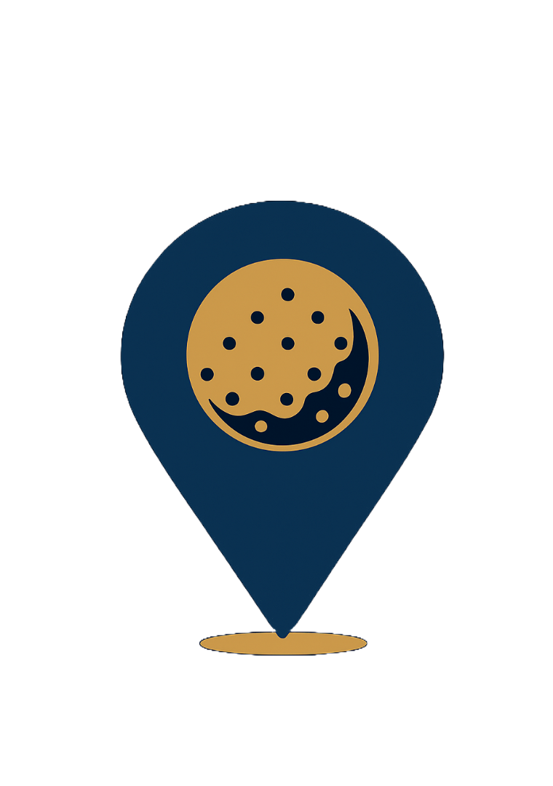
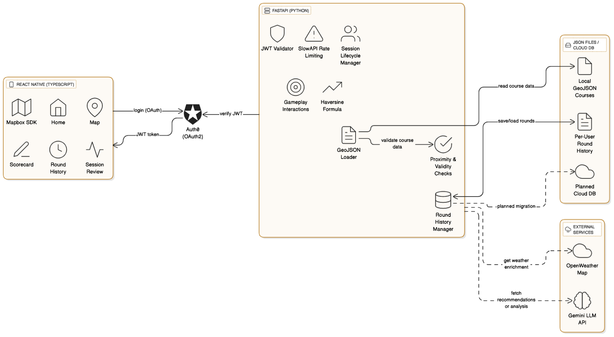

# Golf GPS & Caddy App
<p align="center">
  
</p>

---

## One-line summary
A mobile golf assistant for real-time course navigation, shot tracking, score automation, and AI-powered round analysis.

---

## Project Summary
This mobile app helps golfers navigate courses in real time by mapping hazards, calculating distances, and logging shots during play. It models courses from GeoJSON data, uses Mapbox for visualization, integrates live weather data, and supports logging and reviewing sessions.  

It also features planned AI integration using LLMs to provide players with personalized post-round coaching feedback.

---

## Key Features
- Real-time GPS tracking of the player's position
- Live distance-to-hole calculations
- Hazard mapping based on GeoJSON course data
- Interactive Mapbox-based course display
- Session logging and round history viewing
- Weather integration using OpenWeatherMap API
- Secure authentication with Auth0 and JWT
- Planned AI-powered shot recommendations and post-round feedback generation using LLMs

---

## Architecture Overview

**Frontend (React Native)**
- Mapbox maps with custom course layers
- GPS sensor input and live player tracking
- Session and authentication state management with Context
- Secure token storage using EncryptedStorage
- Auth0 for OAuth login

**Backend (FastAPI)**
- RESTful endpoints serving course metadata, session management, and shot logging
- GeoJSON parsing and course modeling
- Weather data fetching from OpenWeatherMap
- JWT-based authentication and authorization
- Rate limiting for API protection
- Integration with LLMs (e.g., Gemini) for generating personalized coaching feedback

**Persistence**
- JSON or database storage for session and round history
- GeoJSON files for course geometry

**Third-party Services**
- Mapbox for map rendering
- OpenWeatherMap for real-time weather data
- Gemini LLM API for AI-generated coaching feedback

---

## Architecture Diagram
*(Golf GPS & Caddy Mobile App high level architecture. (Click image for higher quality))*
<p align="center">
  
</p>

---

## Technologies Used
- React Native (Expo)
- FastAPI
- Python
- TypeScript
- Mapbox SDK
- Auth0
- OpenWeatherMap API
- Gemini API (or other LLM provider) for AI-based coaching feedback
- JWT for authentication
- EncryptedStorage
- Postgres or JSON for persistence

---

## Safety and Security Features
- JWT-based authentication and route protection
- Rate limiting to prevent abuse (FastAPI-limiter)
- Secure token storage on-device using EncryptedStorage
- Secure OAuth 2.0 flow with Auth0
- Role-based session validation to prevent token misuse
- Input validation using Pydantic models
- Server-side locking for thread-safe session state
- Careful prompt construction and response validation for LLM outputs

---

## Lessons Learned and Challenges
- Designing efficient RESTful APIs for mobile clients
- Modeling real-world golf courses from GeoJSON data
- Integrating Mapbox with live GPS tracking
- Fetching and incorporating live weather data
- Managing mobile authentication securely with OAuth
- Planning concurrency-safe session state in the backend
- Designing LLM prompts for clear, domain-specific feedback
- Managing prompt construction and safe handling of model responses

---

## Testing
- Manual end-to-end testing on physical devices and emulators
- Unit tests for backend utilities (distance calculations, GeoJSON parsing)
- Testing of rate limiting and authentication flows
- Validation of concurrency safety with simulated simultaneous requests

---

## Code Snippets

Below are selected excerpts demonstrating secure API design, geospatial logic, session management, AI integration, authentication, and frontend mapping.

---

### Backend Code Snippets

#### 1. FastAPI Endpoint with Validation and Rate Limiting
```python
class ShotRequest(BaseModel):
    latitude: float
    longitude: float
    club: str

@router.post("/log_shot")
@limiter.limit("10/minute")
def log_shot(
    request: Request,
    payload: ShotRequest,
    token_payload: dict = Depends(verify_token),
    session_dep: WithSession = Depends()
):
    player_id = token_payload['sub']
    if player_id != session_dep.player_id:
        raise HTTPException(status_code=403, detail="Token player mismatch with session.")

    with session_dep.lock:
        session_dep.session.take_shot(
            Coordinate(payload.latitude, payload.longitude),
            payload.club
        )
    return {"message": "Shot logged"}
```

### 2. Session Manager with Thread-Safe Locks
```python
class SessionManager:
    def __init__(self):
        self.sessions: Dict[str, GameSession] = {}
        self.locks: Dict[str, threading.Lock] = {}

    def create_session(self, player_id: str, course_name: str) -> GameSession:
        start_position = Coordinate(47.6062, -122.3321)
        player = Player(player_id, start_position)
        course = load_course_from_geojson(course_name, "data/willows_run.geojson")
        session = GameSession(player, course)
        self.sessions[player_id] = session
        self.locks[player_id] = threading.Lock()
        return session

    def get_lock(self, player_id: str) -> threading.Lock:
        return self.locks.get(player_id)
```

### 3. GameSession Class Skeleton
```python
class GameSession:
    def __init__(self, player: Player, course: Course, session_id: str = None, weather=None):
        self.session_id = session_id or str(uuid.uuid4())
        self.player = player
        self.course = course
        self.current_hole = 1
        self.holes_scores = {}
        self.hazards_encountered = set()
        self.round_history = {}
        self.weather = weather
```

### 4. LLM Feedback Generation
```python
def generate_llm_feedback(
    round_summary: dict,
    model_name: str = "gemini-2.0-flash",
    system_instruction: str = "You are a golf coach providing feedback on a player's performance.",
    temperature: float = 0.2
) -> str:
    try:
        user_prompt = f"""Here is the player's round summary:

{format_round_summary(round_summary)}

Please analyze their performance, note strengths, weaknesses, and give advice for next time. Be specific and constructive.
"""

        response = client.models.generate_content(
            model=model_name,
            config=types.GenerateContentConfig(
                system_instruction=system_instruction,
                temperature=temperature
            ),
            contents=[
                {"role": "user", "parts": [{"text": user_prompt}]}
            ],
        )

        feedback = getattr(response, "text", None)
        if not feedback:
            raise ValueError("LLM returned no text")

        return feedback.strip()

    except Exception as e:
        print(f"Error generating LLM feedback: {e}")
        return "Sorry, I couldn't generate feedback at this time."
```

### 5. GeoJSON Parsing Utility
```python
def load_course_from_geojson(course_name: str, geojson_path: str) -> Course:
    with open(geojson_path) as f:
        data = json.load(f)

    course = Course(course_name)
    for feature in data.get('features', []):
        props = feature.get('properties', {})
        geometry = feature.get('geometry', {})

        if props.get('golf:course:name', '').lower() != course_name.lower():
            continue

        if props.get('golf') == 'hole' and geometry.get('type') == 'LineString':
            ref = int(props.get('ref', -1))
            par = int(props.get('par', 4))
            coords = geometry.get('coordinates', [])
            if coords:
                start = Coordinate(coords[0][1], coords[0][0])
                end = Coordinate(coords[-1][1], coords[-1][0])
                hole = Hole(ref, start, end, par)
                course.add_hole(hole)
    return course
```

### 6. Geospatial Distance Calculation (Haversine)
```python
def calculate_distance(coord1: Coordinate, coord2: Coordinate):
    R = 6371000
    phi1 = math.radians(coord1.latitude)
    phi2 = math.radians(coord2.latitude)
    delta_phi = math.radians(coord2.latitude - coord1.latitude)
    delta_lambda = math.radians(coord2.longitude - coord1.longitude)
    a = (math.sin(delta_phi / 2) ** 2 +
         math.cos(phi1) * math.cos(phi2) * math.sin(delta_lambda / 2) ** 2)
    c = 2 * math.atan2(math.sqrt(a), math.sqrt(1 - a))
    return R * c
```

---

### Frontend Code Snippets

### 1. Auth0 Login Integration

```tsx
const auth0 = new Auth0({ domain, clientId });

const login = async () => {
  const credentials = await auth0.webAuth.authorize({ scope, redirectUrl });
  await EncryptedStorage.setItem('accessToken', credentials.accessToken);
  const userInfo = await auth0.auth.userInfo({ token: credentials.accessToken });
  setAccessToken(credentials.accessToken);
  setPlayerId(userInfo.sub ?? null);
};
```

### 2. Session Context Provider

```tsx
export const SessionProvider = ({ children }) => {
  const [playerId, setPlayerId] = useState(null);
  const [accessToken, setAccessToken] = useState(null);

  return (
    <SessionContext.Provider value={{ playerId, accessToken, setPlayerId, setAccessToken }}>
      {children}
    </SessionContext.Provider>
  );
};
```

### 3. Secure Axios Interceptor

```tsx
backend.interceptors.request.use(async (config) => {
  const token = await EncryptedStorage.getItem('accessToken');
  if (token) config.headers.Authorization = `Bearer ${token}`;
  return config;
});
```

### 4. Mapbox Integration Example

```tsx
<MapView style={{ flex: 1 }} styleURL={StyleURL.Satellite}>
  <Camera followUserLocation followZoomLevel={16} />
  <LocationPuck visible />
  <ShapeSource id="course" shape={geoJsonData}>
    <LineLayer id="courseLine" style={courseStyle} />
  </ShapeSource>
</MapView>
```

### 5. Navigation Setup

```tsx
<NavigationContainer>
  <Stack.Navigator initialRouteName="Welcome">
    <Stack.Screen name="Welcome" component={WelcomeScreen} />
    <Stack.Screen name="MainTabs" component={TabNavigator} />
  </Stack.Navigator>
</NavigationContainer>
```

### 6. API Call Example (/log_shot)

```tsx
export const logShot = async ({ latitude, longitude, club }) => {
  return (await backend.post('/log_shot', { latitude, longitude, club })).data;
};
```

---

## Screenshots
*(Include 2–4 high-quality images here showing the map view, course selection screen, session review, etc.)*

---

## Demo Video
*(Link to your private or unlisted video demo here.)*

---

## How to Run (Optional)
*This codebase is not publicly shared in full. For selected recruiters or interviewers, I can demonstrate the app live or share additional details upon request.*

---

## Contact
Manav Shah  
Email: mfshahx@gmail.com  
LinkedIn: linkedin.com/in/manav-shah1/  
GitHub: github.com/manavshah-boop

